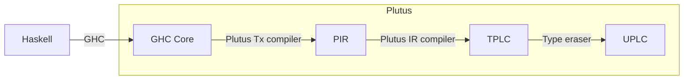

# Piecemeal

Building a contract piecemeal, and assessing how each change impacts the network cost (script size).

This repo is based off the slimmed down DanaSwap repo (not `plutus-starter`, as it uses a suboptimal Nix setup for Haskell).

Run `cabal run` in nix-shell. Or `ghcid -T :main`.

## Sizes

Code size in bytes for each validator [defined here](https://github.com/ArdanaLabs/Piecemeal/tree/main/src/Piecemeal):

| File              | Validator                                 | Script size in bytes |
| ----------------- | ----------------------------------------- | -------------------: |
| Empty.hs          | ()                                        |                   14 |
|                   | Empty.hs, with `ScriptContext`[^ectx]     |                 2065 |
| TypedValidator.hs | (), Typed Validator                       |                 2498 |
| Hello.hs          | `data`, `newtype` (w/ `TypedValidator`)   |                 2575 |
| -                 | `data`, `newtype` (sans `TypedValidator`) |                 2224 |

## Notes

Plutus compilation pipeline:

1. GHC: Haskell -> [GHC Core](https://serokell.io/blog/haskell-to-core)
1. Plutus Tx compiler: GHC Core -> Plutus IR (**PIR**)
1. Plutus IR compiler: Plutus IR -> Typed Plutus Core (**TPLC**)
1. Type eraser: Typed Plutus Core -> Untyped Plutus Core (**UPLC**)



To get the PIR representation, run `show` on:

```haskell
import qualified Prettyprinter as PP
import qualified PlutusTx.Code as PC

validatorPir :: PP.Doc ann
validatorPir =
  PP.pretty $
    PC.getPir
      $$(PlutusTx.compile [||mkValidator||])
```

For our Empty validator, this will dump the simplest PIR:

```lisp
(program
  (let
    (nonrec)
    (datatypebind
      (datatype (tyvardecl Unit (type))  Unit_match (vardecl Unit Unit))
    )
    (lam ds (con data) (lam ds (con data) (lam ds (con data) Unit)))
  )
)
```

To dump TPLC,

```haskell
{-# OPTIONS_GHC -fplugin-opt PlutusTx.Plugin:dump-plc #-}
```

To dump UPLC,

```haskell
{-# OPTIONS_GHC -fplugin-opt PlutusTx.Plugin:dump-uplc #-}
```

- [ ] human readable TPLC
- [ ] human readable UPLC

## Resources

- [How to analyse the cost and size of Plutus scripts](https://marlowe-playground-staging.plutus.aws.iohkdev.io/doc/plutus/howtos/analysing-scripts.html)
  - [ ] Use EmulatorTrace monad, and then calculate costs
- [Plutus Tx: compiling Haskell into Plutus Core](https://iohk.io/en/blog/posts/2021/02/02/plutus-tx-compiling-haskell-into-plutus-core/)
- [Compiler optimizations for smaller script outputs #4174](https://github.com/input-output-hk/plutus/issues/4174)

[^ectx]: Determined by applying this patch on to `Empty.hs`:

      ```diff
      {-# INLINEABLE mkValidator #-}
      mkValidator :: BuiltinData -> BuiltinData -> BuiltinData -> ()
      -mkValidator _ _ _ = ()
      +mkValidator d r ctx =
      +  mkValidator' d r (PlutusTx.unsafeFromBuiltinData ctx)
      +
      +{-# INLINEABLE mkValidator' #-}
      +mkValidator' :: BuiltinData -> BuiltinData -> ScriptContext -> ()
      +mkValidator' _ _ _ = ()
      ```
